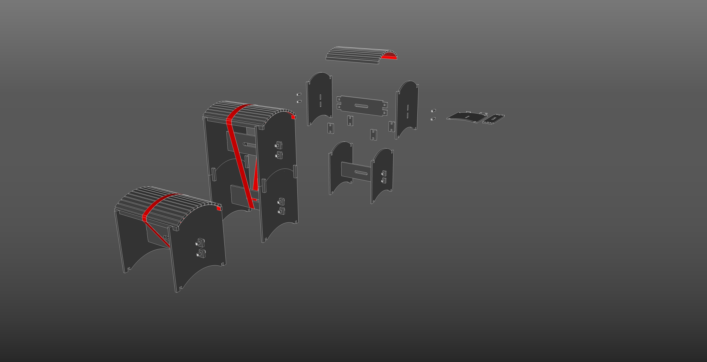
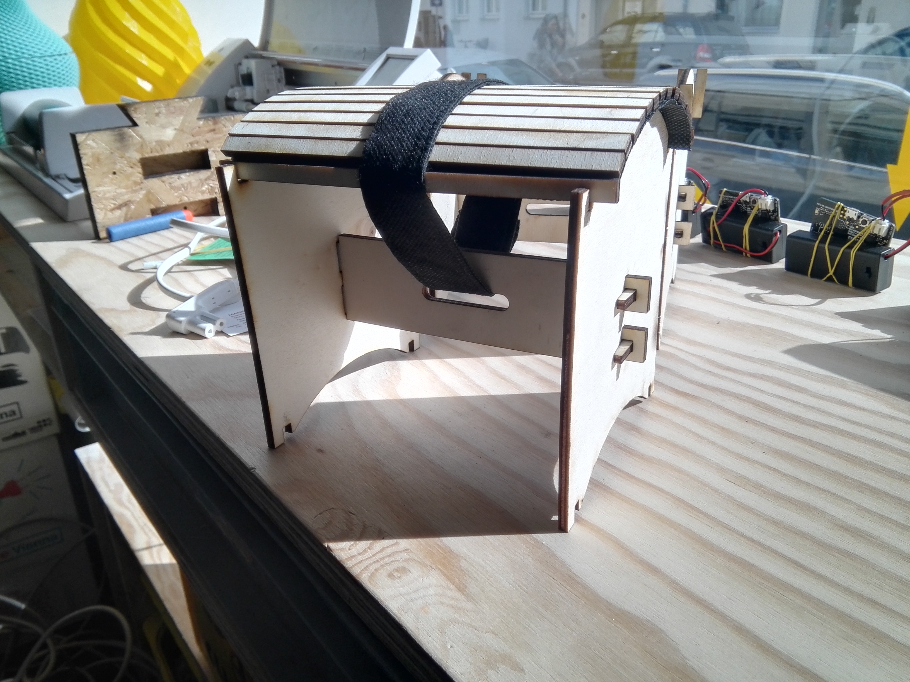
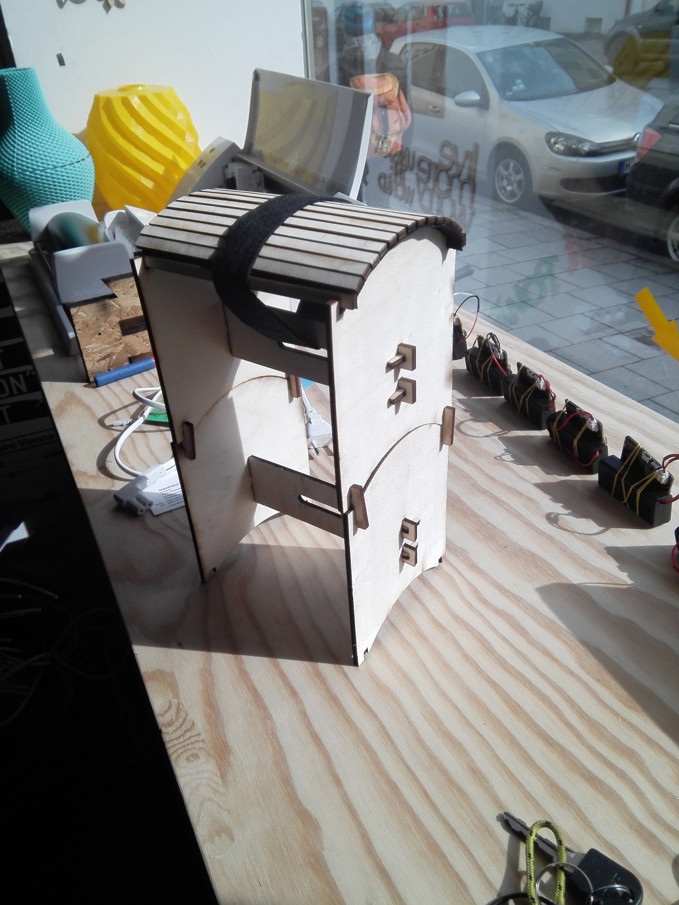

# Barhocker

Ein Design für ein stapelbaren Hocker, der mit einer kleinen Fräse produziert werden kann. Wir haben im erfindergarden nur eine Stepcraft mit einem Arbeitsbereich von ca 40 x 55 cm. Die einzelnen Bauteile dürfen dieses Maße also nicht überschreiten.

## Design

Geplant und gestaltet mit Sketchup im [erfindergarden](http://www.erfindergarden.de). Danke an Trimble-Sketchup für die kostenlose Pro Version für Schulen wie den erfindergarden. Und danke an Andreas Kopp für den Aufbau des www.erfindergardens.de.

Gefertigt wird der Hocker aus 12 mm Funiersperrholz. Die Verbindungen werden klassisch durch gesteckte Keile gehalten. Der Hocker ist somit zerlegbar und leich zu transportieren. 
Die Sitzfläche wird aus einzelnen Holzstäben und einer Lastwagenplane gefertigt. Die Holzstäbe werden hierfür auf die Plane geklebt.
Zusammengehalten wird das ganze durch einen Handelsüblichen Spanngurt, farblich abgetimmt auf die Lastwagenplane.

## Modell

Bis jetzt wurde nur ein Modell im Maßstab 1:3 mit dem Lastercutter aus 4mm Birkensperrholz angefertigt. Die Realisation in 1:1 steht noch aus.

